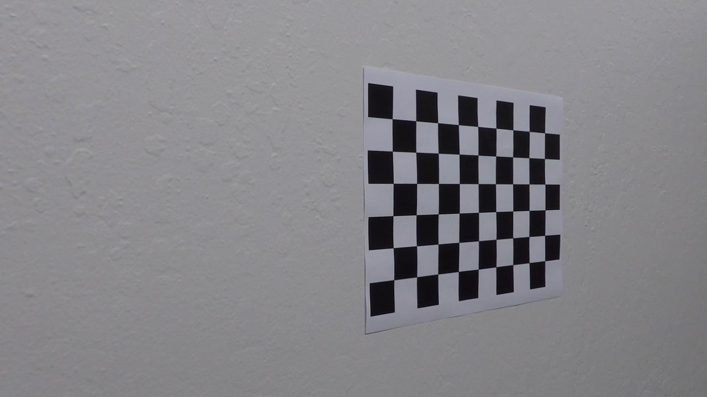
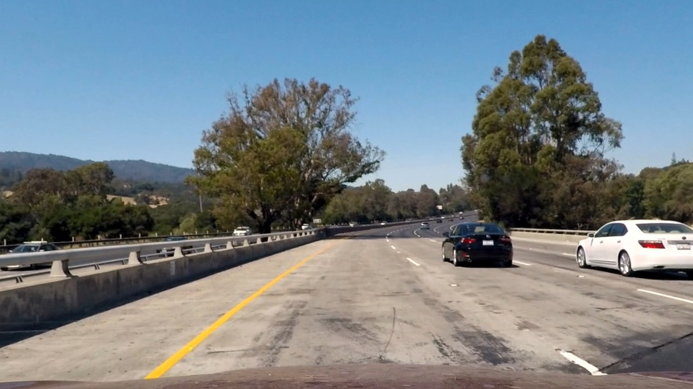
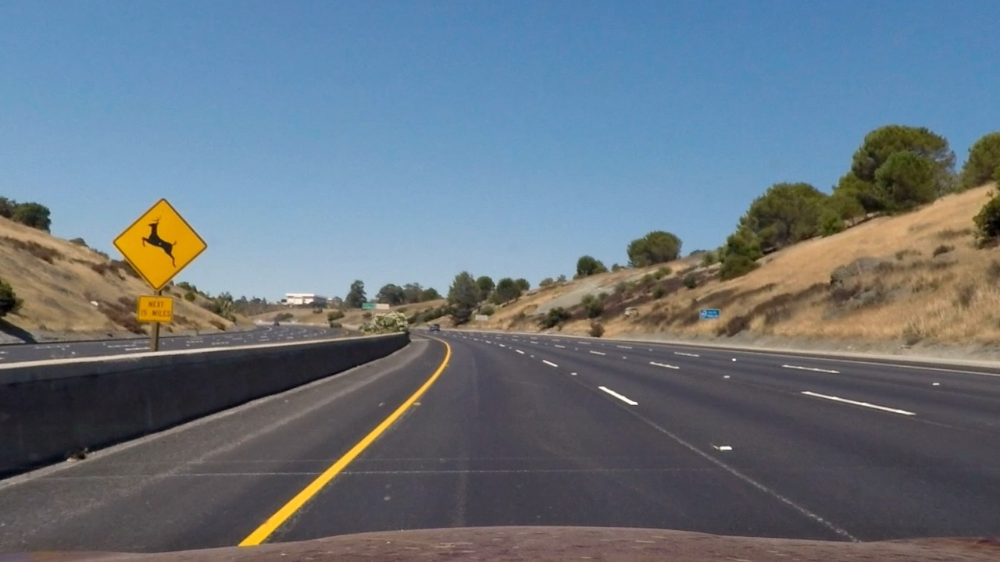
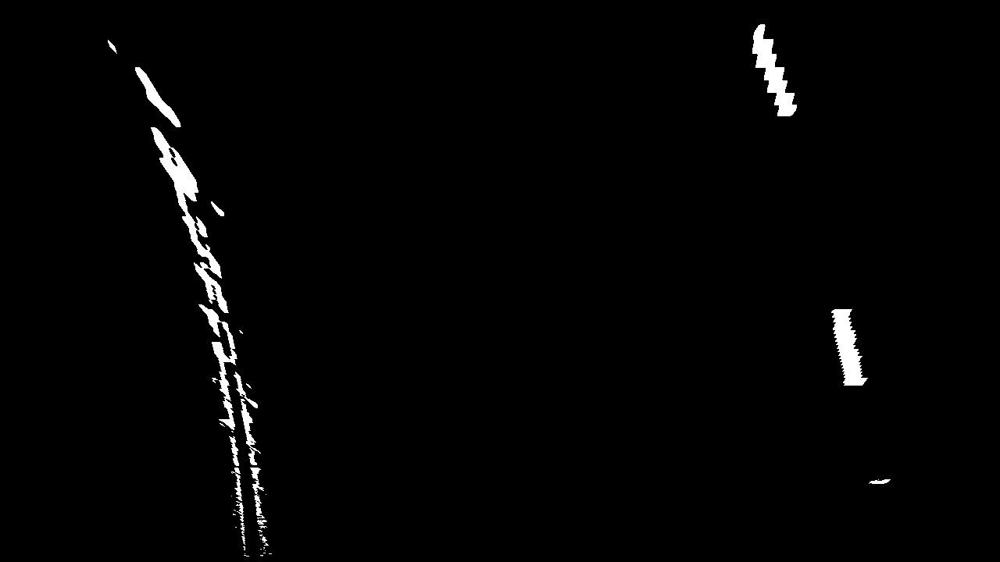
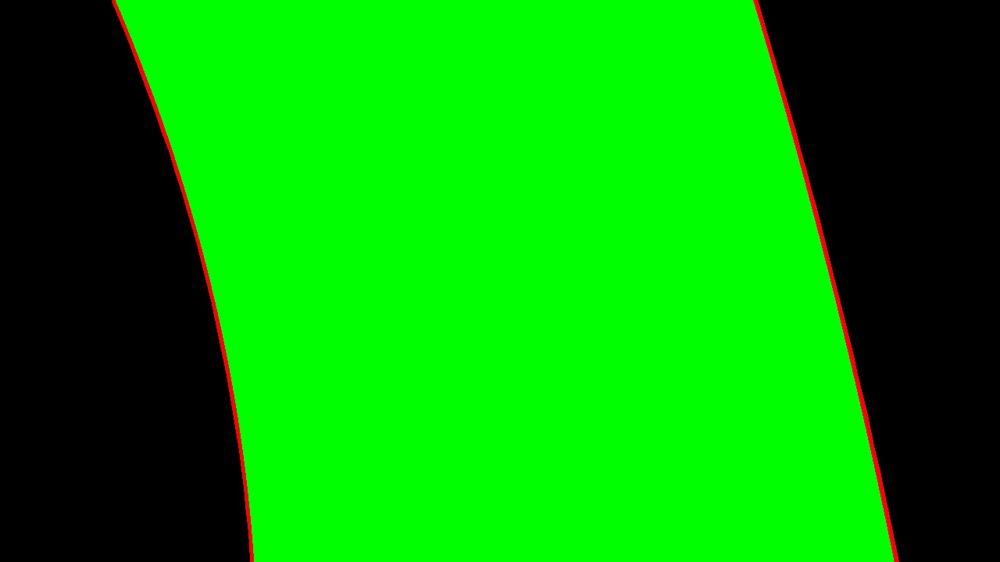
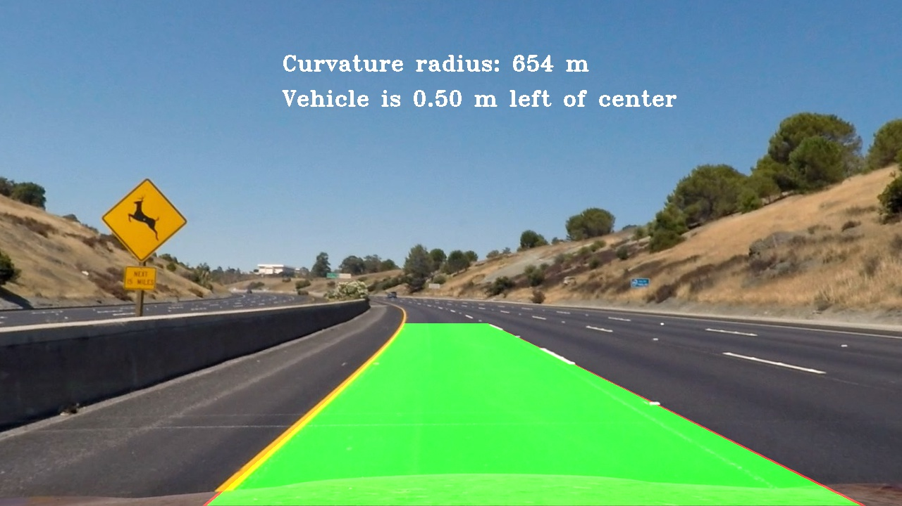

**Advanced​ Lane Lines Finding Project**
=======================================

[Self-Driving Car Engineer Nanodegree Program]

Description
-----------

When we drive, we use our eyes to decide where to go. The lines on the road that
show us where the lanes are act as our constant reference for where to steer the
vehicle. Naturally, one of the first things we would like to do in developing a
self-driving car is to automatically detect lane lines using an algorithm. This
algorithm will take a video taken from a car on the road as in input and will
detect the lane lines.

Advanced lane lines detection tecniques will be developed using Python and
OpenCV. OpenCV means "Open-Source Computer Vision", which is a package that has
many useful tools for analyzing images.

This project has been developed using also a [Jupyter
Notebook](https://jupyter.org/) which made the prototyping very quick.

Dependencies
------------

In order to successfully run the Jupyter Notebook containing the code, several
dependencies need to be installed.

[CarND-Term1-Starter-Kit](https://github.com/udacity/CarND-Term1-Starter-Kit)
contains the starter kit needed for this purpose. During the development
[Anaconda platform](https://www.anaconda.com/) was used.

Implementation design
---------------------

Since measures and distances are crucial in localizing the ego car and the other
objects, the first step of this algorithm is to remove the distortion in the
image introduced by the camera lens, i.e. to calibrate the camera:

### Camera Calibration

The calibration of the camera is performed using a set of chessboard images
taken with the camera that will be used in the video of the car. OpenCV library
is used to achieve this result and given a set of fixed parameters `(objpoints
`and `imgpoints `which represents the mapping between the real points in the 3D
space and the `2D points `in image space`)` and a set of calibration images it
will return the matrices to correct the distorted images.

The code for this step is contained in the third and fourth cells of the IPython
notebook `advanced_lane_lines.ipynb`.

`objpoints` and `imgpoints` are used to compute the camera calibration and
distortion coefficients using the `cv2.calibrateCamera()` function. I applied
this distortion correction to the test image using the `cv2.undistort()`
function and these are the results:

Distorted image:

Undistorted image:

The result is even more evident when using a test image taken from the car.

Distorted image:

Undistorted image:

### Image Processing Pipeline

After the calibration step (i.e. retrieving the coefficients needed to remove
the distortion from the images) has been completed, several techniques were used
in this algorithm to detect the lane lines:

The pipeline used is the following (in order):

-   Undistortion of the image using the matrices and coefficients obtained
    during the calibration phase

-   Transforming the colored image in a binary one using masking, to identify
    white lanes and yellow lanes:

    1.  As regards yellow lanes, the image is converted to HSV space
        $$($$https://en.wikipedia.org/wiki/HSL_and_HSV) and a lower and upper
        thresholding is applied to each of those channels. The values for the
        thresholding were searched in the internet and refined after some
        testing

    2.  For white lanes the masking applied, still upper and lower thresholding,
        is directly on RGB (or BGR) color space

    3.  The results of both HSV and RGB masking are combined using an OR set
        operator (i.e. both of the results obtained are kept) and the pixels are
        set to 1, while all the others are set to 0, obtaining a binary image
        with the lanes highlighted

-   A region of interest of the image is selected and on that a perspective
    transform to rectify the binary image ("birds-eye view") is performed. The
    warping attributes (i.e. the region borders in the starting image and the
    borders in the result image) to perform the perspective transform have been
    defined after trial and error approach. Once the matrix to perform the
    perspective transform has been obtained passing the warping attributes to
    OpenCV `cv2.getPerspectiveTransform` function,  `cv2.warpPerspective` has
    been used to obtain the binary birdeye image. For example:

    Undistorted image:

Binary bird-eye image (after HSV, RGB thresholding and warping):

-   At this stage an histogram method is used to detect the lane lines. Since
    the algorithm will be used on a video of the car, also information from
    previous frames will be used. This stage works as follows:

    1.  The image is divided into `N` windows, on the vertical direction. For
        each window `i`:

        1.  If at least one of the lanes was correctly detected in the last
            processed frame not leveraging on the information of the previous
            frames, takes the horizontal indexes for both right and left lanes
            for the window `i` calculated in that frame.

            Otherwise:

            1.  Compute the `y-sum` (vertical sum) in the current window *i* for
                each horizontal coordinate `x`

                1.  Considers only two horizontal regions in the form
                    `(x_left-threshold,x_left+threshold)` and
                    `(x_right-threshold,x_right+threshold)`where `x_left` and
                    `x_right` are the indexes calculated in the previous
                    iteration (i.e. in the previous window *i*). If it is a
                    first iteration a default value is applied.

                    For each region extract the horizontal coordinate
                    corresponding to the maximum `y_sum`

                2.  Perform a robustness check: if the obtained indexes are
                    different from `x_left` and `x_right` of the previous frame
                    more then 20%, then make an average of them. Otherwise keep
                    them as they are.

        2.  If the distance between `x_left `and `x_right` is bigger then a
            reasonable threshold continue, otherwise skip at the next iteration.

        3.  Take the original bird eye image and compute, for both `x_left `and
            `x_right ` the mean of the indices corresponding to a pixel in the
            region `(x-x_window,x+x_window)`. This enforces robustness.

        4.  Store the result of this iteration in a dedicated lane object (frame
            dependent) attribute

        5.  Store in an dedicated array all the indices found at step 2

    2.  Return the indexes of the points found for all the N` `windows

    3.  Repeat the algorithm using 3 different values for `N` and for the
        `x_window` threshold. The more `N` is big (smaller vertical windows used
        for the histogram) the more `x_window` will be big (larger horizontal
        windows to be considered when looking for the points in the bird eye
        image)

    4.  Use numpy `polyfit()` function to fit (minimizing the MSE) a second
        degree polynomial to the points obtained

        1.  For each polynomial calculates the curvature radius associated with
            the lane, and perform a robutsness check: if the last frame the lane
            was identified, consider a 60% range of tolerance between the radius
            just calculated an the last. If in the last frame the lane was not
            identified (meaning that the information came from previous frames)
            consider a 100% range of tolerance. If the tolerance (in both cases)
            was not respected, take the lane from previous frame.

    5.  Highlighting the quadratic polynomial lane lines and the lane itself

    This is the result on the same test image:

 

-   Warp back the image obtained to the initial one and print the curvature
    radius and where the ego car is positioned inside the lane

Final result:

 

Final video result
------------------

[Here](project_video_result.mp4) the final result applied to the video of a car
circulating on a highway.
